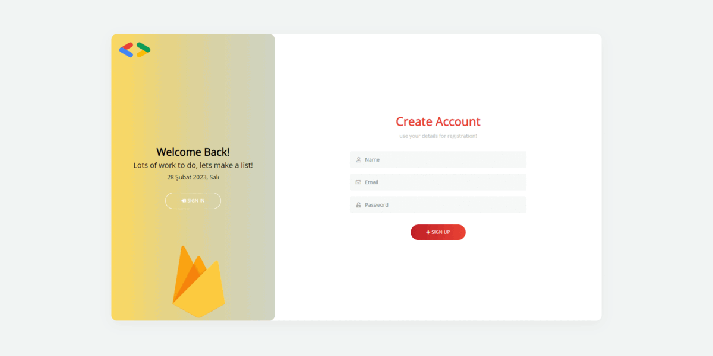

# Firebase Todo List Backend

In this project, I talked about creating Todolist using Firebase. I mainly used Javascript. Thanks to the codes we have integrated into the project, I used Firebase as a database.


* First of all, in order to use Firebase in our project, we need to import the following codes into the project.
```
<script src="https://www.gstatic.com/firebasejs/8.9.1/firebase-app.js"></script>
     <script src="https://www.gstatic.com/firebasejs/8.9.1/firebase-auth.js"></script>
     <script src="https://www.gstatic.com/firebasejs/8.9.1/firebase-firestore.js"></script>
```

* In order to perform the authentication process in Firebase, the Firebase account we created must have the config information they gave us.

```
   const firebaseConfig = {
     apiKey: "xxxxxxxxxxxxxxxxxxxxxxxxxxxxxxx",
     authDomain: "gdg-izmir-fa06c.firebaseapp.com",
     projectId: "gdg-izmir-fa06c",
     storageBucket: "gdg-izmir-fa06c.appspot.com",
     messagingSenderId: "xxxxxxxxxxxxxxxxxx",
     appId: "xxxxxxxxxxxxxxxxxxxxxxxx"
   };

   // Initialize Firebase
   const app = initializeApp(firebaseConfig);
```

* After creating these fields, I created a todolist using Javascript.

* In the user interface, I used HTML-CSS and Boostrap.



> If you want to get detailed information about the project and use Firebase, you can watch my broadcast at the event organized by [Google DSC Galatasaray Universty](https://www.youtube.com/watch?v=pGcwnL2Wc3U&t=3956s)